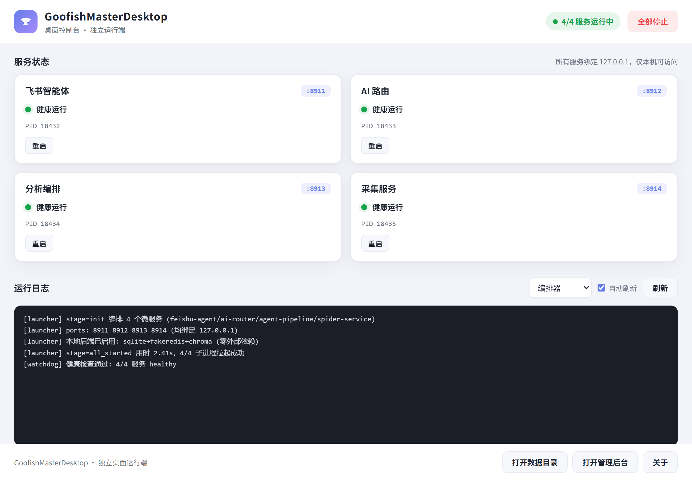
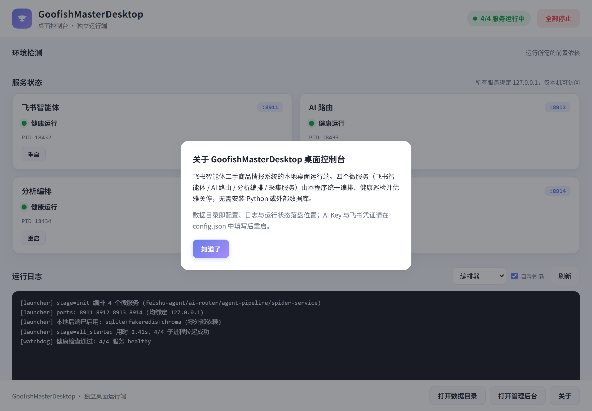

# GoofishMasterDesktop

**闲鱼圣手桌面独立运行端** —— 飞书智能体二手商品情报系统的本地桌面运行形态。

四个微服务（飞书智能体 / AI 路由 / 分析编排 / 采集服务）由统一编排器拉起、健康巡检并优雅关停，**零 Docker、零命令行、零外部数据库**——双击即用。所有数据存储（SQLite / fakeredis / Chroma）全部进程内嵌入式，随程序同级落盘。

## 下载（v1.1.2 稳定版）

> 当前安装包**未做数字签名**，Windows SmartScreen 可能弹出「Windows 已保护你的电脑」，点「更多信息」→「仍要运行」即可，不影响功能。

- **GitHub Releases**：[v1.1.2 安装包（约 580MB）](https://github.com/ayongsheng777-rgb/GoofishMasterDesktop/releases/tag/v1.1.2)

> v1.1.2 新增：日志崩塌修复、AI 429 指数退避、多页采集参数（`找 XX N页`）。v1.1.1 已含：「重新配置」彻底清理、飞书「停止搜索」指令、窗口最小化至托盘、内置《使用说明》文档。详见 [RELEASE_NOTES.md](RELEASE_NOTES.md)。

## 特性

- **双击即用**：PyInstaller 单 exe + Inno Setup 安装包，无需安装 Python / Docker / PostgreSQL / Redis / Qdrant
- **全嵌入式数据层**：PostgreSQL→SQLite、Redis→fakeredis、Qdrant→Chroma，默认全开，零外部依赖
- **桌面控制台**：pywebview + 系统托盘，可视化查看服务状态 / 日志 / 配置，一键启停
- **飞书长连接**：WebSocket 直连飞书，**无需公网 IP / 回调域名**——家用网络即可
- **多模型路由**：DeepSeek（主） / Gemini（视觉） / Qwen（备 + embedding），热切换不重启
- **RAG 知识库**：Chroma 向量库 + 语义检索，分析时自动注入相似案例
- **优雅降级**：后端可单独关闭，主功能不受影响；前端只对真异常弹红告警
- **品牌化图标**：`app.ico` 已集成到 PyInstaller 打包产物与 Inno Setup 安装包，生成 exe、安装向导、桌面快捷方式均使用统一图标

## 运行演示

> 以下为桌面控制台在本地四服务全部健康运行时的实际界面截图（由 Playwright 渲染 `desktop/ui/index.html` + 模拟后端 API 生成）。

### 控制台主界面



- 顶栏显示品牌名与 `4/4 服务运行中` 状态
- 服务卡片实时展示：飞书智能体、AI 路由、分析编排、采集服务的运行/健康/PID 信息
- 运行日志区展示编排器拉取 4 个子进程成功的日志
- 配置概览区显示端口、本地后端启用、AI Key 配置状态

### 关于弹层



## 架构

```
┌─────────────────────────────────────────────────────────┐
│           GoofishMasterDesktop.exe（编排器）              │
│   双击 → 桌面控制台 + 自动拉起 4 服务 + 系统托盘常驻       │
└────────────┬────────────────────────────────────────────┘
             │ subprocess（按依赖顺序）
   ┌─────────┴─────────┬──────────────┬──────────────┐
   ▼                   ▼              ▼              ▼
feishu-agent        ai-router     agent-pipeline  spider-service
  :8911               :8912          :8913           :8914
飞书长连接+WebUI    多模型路由+RAG   编排+决策打分    闲鱼采集
   │                   │              │              │
   └─── fakeredis ─────┴── SQLite ────┴── Chroma ────┘
                        （全部进程内嵌入式）
```

| 服务 | 端口 | 职责 |
|------|------|------|
| feishu-agent | 8911 | 飞书 WebSocket 长连接 + WebUI 管理后台 |
| ai-router | 8912 | 多模型路由（DeepSeek/Gemini/Qwen）+ RAG |
| agent-pipeline | 8913 | 搜索编排 + AI 三维分析 + 决策打分 |
| spider-service | 8914 | 闲鱼商品采集（Playwright 无头浏览器） |

全部绑定 `127.0.0.1`，仅本机可访问。

## 安装

### 方式一：安装包（推荐普通用户）

1. 下载 `GoofishMasterDesktop-Setup-1.1.1.exe`
2. 双击运行安装向导
3. 选择安装路径（默认 `D:\GoofishMasterDesktop`，可改）
4. 设置 4 个服务端口（默认 8911-8914，可改，均绑定 127.0.0.1）
5. 勾选「创建桌面快捷方式」
6. 安装完成 → 桌面双击 `GoofishMasterDesktop` 即用

> **安装包已内置全部运行依赖**：
> - 全部 Python 依赖（chromadb / fakeredis / aiosqlite 等），无需安装 Python
> - **Playwright Chromium（rev 1234）随安装包分发**，落在 `{app}\playwright-browsers`，采集服务离线即可用，无需系统安装 Chrome/Edge
> - **固定版本 WebView2 运行时随包携带**（落在 `{app}\webview2_runtime`，程序启动自动优先使用）——完全不依赖系统 WebView2 Runtime，免 UAC、免联网，目标机不装任何运行时也能打开桌面窗口

### 前置依赖检测

桌面控制台顶部新增「环境检测」卡片，实时显示两项前置依赖状态：

- **WebView2 Runtime**：桌面窗口渲染依赖（缺失时窗口打不开，但后端仍可在浏览器管理）
- **随附 Chromium**：采集服务离线采集依赖（缺失时退化为使用系统 Chrome/Edge）

也可用命令行自检：

```bash
GoofishMasterDesktop.exe preflight
# 输出 JSON：{"webview2_installed": true, "chromium_installed": true, "all_ok": true, ...}
```

### 方式二：源码运行（开发者）

```bash
git clone https://github.com/ayongsheng777-rgb/GoofishMasterDesktop.git
cd GoofishMasterDesktop

# Python 3.13+
python -m venv .venv
.venv\Scripts\activate
pip install -r requirements.txt

# 采集服务需要 Playwright Chromium（须与打包驱动同修订号 1234）
playwright install chromium

# 启动全部服务（命令行模式）
python launcher.py start

# 或打开桌面控制台（GUI 模式）
python desktop/app.py
```

首次运行会在 `config/config.json` 自动生成配置（含随机 `secret_key`）。

### 方式三：便携版

下载 `release/GoofishMasterDesktop/` 整个目录，双击 `GoofishMasterDesktop.exe` 即可，无需安装。配置与数据落在 exe 同级目录。

## 配置

配置文件：`config/config.json`（首次启动自动生成）。修改后需重启服务生效。

```json
{
  "secret_key": "（首次启动自动生成）",
  "ports": {
    "feishu_agent": 8911,
    "ai_router": 8912,
    "agent_pipeline": 8913,
    "spider": 8914
  },
  "backends": {
    "postgres": { "enabled": true },
    "redis": { "enabled": true },
    "qdrant": { "enabled": true }
  },
  "feishu": {
    "app_id": "cli_xxxx",
    "app_secret": "xxxx"
  },
  "ai": {
    "deepseek_api_key": "sk-xxxx",
    "gemini_api_key": "",
    "qwen_api_key": "",
    "proxy_url": ""
  }
}
```

**必填项**：
- `feishu.app_id` / `feishu.app_secret` —— 飞书自建应用凭证
- `ai.deepseek_api_key` —— 主 AI 模型（必填，否则分析功能不可用）

**可选项**：
- `ai.gemini_api_key` —— 视觉分析（识图），走代理
- `ai.qwen_api_key` —— 备用聊天模型 + RAG embedding（`text-embedding-v3`）
- `ai.proxy_url` —— 访问境外 AI 服务的 HTTP 代理地址

**后端开关**（默认全开，一般无需动）：
- `backends.postgres.enabled` → 实际用 SQLite
- `backends.redis.enabled` → 实际用 fakeredis
- `backends.qdrant.enabled` → 实际用 Chroma
- 全部置 `false` 会优雅降级（主功能不受影响，但持久化监控 / 会话缓存 / RAG 会禁用）

## 操作说明

### 桌面控制台（GUI）

双击 exe 后打开控制台窗口，功能：

- **服务状态**：实时显示 4 服务的运行状态（健康/启动中/已停止）+ PID，每 3 秒刷新
- **全部启动 / 全部停止**：一键控制
- **重启单个服务**：点服务卡片「重启」按钮
- **运行日志**：选择服务查看最近 300 行日志，支持自动刷新
- **配置概览**：端口 / 后端启用状态 / AI Key 配置情况 / 飞书凭证
- **打开管理后台**：用系统默认浏览器打开 `http://127.0.0.1:8911`（WebUI 管理面板）
- **打开数据目录**：在资源管理器中打开数据目录（配置 / 日志 / 数据库文件）
- **系统托盘**：关闭窗口→最小化到托盘；托盘菜单可显示控制台 / 启停服务 / 退出

### 命令行

```bash
GoofishMasterDesktop.exe              # 打开桌面控制台（默认）
GoofishMasterDesktop.exe start        # 无界面服务端模式
GoofishMasterDesktop.exe stop         # 停止全部服务
GoofishMasterDesktop.exe status       # 查看服务状态
GoofishMasterDesktop.exe restart <name>  # 重启指定服务
```

### WebUI 管理后台

浏览器访问 `http://127.0.0.1:8911`（端口取自配置）：

- **系统总览**：服务健康 / 基础设施状态 / 降级功能提示
- **AI 配置**：在线配置各模型 Key，热更新不重启
- **RAG 知识库**：管理向量库条目
- **采集任务**：手动触发闲鱼商品搜索 / 分析
- **历史结果**：查看 AI 分析过的商品卡片

## 构建

### 构建 exe（开发者）

```bash
# 环境：Python 3.13 + .venv + 依赖已装
.venv\Scripts\python.exe -m PyInstaller GoofishMasterDesktop.spec --noconfirm
# 产物在 dist/GoofishMasterDesktop/
```

> ⚠️ 若 build/dist 目录已存在，PyInstaller `--clean` 会被 Windows 安全删除拦截。
> 解决：先用 PowerShell `Remove-Item -Recurse` 清掉 build/dist，再不带 `--clean` 构建。

### 构建安装包

需先安装 [Inno Setup 6](https://jrsoftware.org/isdl.php)。

```bash
# 先确保 release/GoofishMasterDesktop/ 是最新构建产物
"C:\Program Files (x86)\Inno Setup 6\ISCC.exe" GoofishMasterDesktop.iss
# 产物在 installer/GoofishMasterDesktop-Setup-<版本>.exe（版本号见 .iss 的 MyAppVersion）
```

## 目录结构

```
GoofishMasterDesktop/
├── launcher.py              # 启动编排器（拉起 4 服务 / 健康检查 / 看门狗 / 前置依赖检测）
├── desktop/                 # 桌面控制台（pywebview + 系统托盘）
│   ├── app.py               # 桌面壳
│   ├── api.py               # JS 桥接 API（含 check_prerequisites）
│   └── ui/                  # 控制台前端（HTML/CSS/JS，含环境检测卡片）
├── common/config.py         # 配置中心
├── services/                # 4 个微服务
│   ├── feishu-agent/        # 飞书长连接 + WebUI
│   ├── ai-router/           # 多模型路由 + RAG
│   ├── agent-pipeline/      # 编排 + 决策打分
│   └── spider-service/      # 闲鱼采集（优先用随附 Chromium）
├── knowledge-base/          # RAG 知识库
├── assets/                  #  README/Release 引用的图片资源（捐赠二维码等）
├── demo/                    # 运行演示截图（README「运行演示」引用）
├── webview2_runtime/        # 固定版本 WebView2 运行时（从本机已装目录复制，约 500MB，不入版本库，随安装包分发）
├── sign.ps1                 # 代码签名脚本（可选增强，默认跳过；需真实 CA 证书）
├── GoofishMasterDesktop.spec      # PyInstaller 打包配置（已含 app.ico）
├── GoofishMasterDesktop.iss       # Inno Setup 安装包脚本（随附固定版 WebView2 运行时 + Chromium）
├── config.example.json      # 配置示例
└── requirements.txt         # Python 依赖
```

## 排障

| 现象 | 处理 |
|------|------|
| 双击 exe 无窗口 | 安装包已随附固定版 WebView2 运行时（无需系统安装）；仍异常则看 `data/logs/desktop-crash.log`，或手动装 [WebView2 Runtime](https://developer.microsoft.com/microsoft-edge/webview2/) |
| 双击闪退 | 看 `data/logs/desktop-crash.log`；命令行 `GoofishMasterDesktop.exe start` 确认服务端是否能起 |
| 8911 打不开 WebUI | 看 `data/logs/feishu-agent.log`；确认服务已启动 |
| 采集失败 | 安装包版已随附 Chromium，检查「环境检测」卡片 Chromium 状态；开发模式需 `playwright install chromium` |
| AI 分析失败 | 检查 `config.json` 的 `ai.deepseek_api_key`；境外模型需配 `ai.proxy_url` |
| 飞书收不到消息 | 检查 `feishu.app_id/app_secret`；看日志长连接是否建立 |
| 端口被占 | 改 `config.json` 的 `ports.*` 或安装时填新端口 |
| 搜索一直「未找到符合条件的商品」 | 绝大多数是**未登录闲鱼**：到管理后台「🐟 闲鱼登录」扫码登录后再搜；已登录仍失败会如实显示「采集失败：…」，按日志排查 |
| 监控任务创建后无反馈 | 确认安装的是 2026-08-05 后的安装包（早期测试版存在 SQLite 持久化被误关的问题，已修复） |

## 技术栈

- **Python 3.13** + FastAPI + Uvicorn（4 微服务）
- **PyInstaller**（冻结为单 exe）
- **pywebview** + **pystray**（桌面控制台 + 系统托盘）
- **aiosqlite**（嵌入式 SQLite，替代 PostgreSQL）
- **fakeredis**（进程内 Redis 兼容层）
- **chromadb**（嵌入式向量库，替代 Qdrant）
- **Playwright**（闲鱼采集无头浏览器）
- **Inno Setup 6**（Windows 安装包）

## 支持作者

> 我是一个在线下经营电脑实体店的普通店主，平时靠给客户修电脑、装机维持生计。`GoofishMasterDesktop`（闲鱼圣手桌面端）是我在工作之余，用 **WorkBuddy** 一点一点做出来的小工具，主要为了自己用着方便，也希望能帮到同样有二手商品监控需求的朋友。
>
> 如果你用下来觉得它确实帮到了你，帮你省了点时间，欢迎扫描下方二维码随意打赏一杯咖啡或一瓶水。金额随意，心意最重要，这份小小的支持会让我有动力继续维护、修复 Bug 和加新功能。先谢过大家！

| 微信支付 | 支付宝 |
| --- | --- |
|  |  |

## 发行说明

测试版发布详情见 [RELEASE_NOTES.md](RELEASE_NOTES.md)。

## 致谢 / Acknowledgements

本项目在开发过程中**参考并借用了** [Usagi-org/ai-goofish-monitor](https://github.com/Usagi-org/ai-goofish-monitor)（闲鱼智能监控系统，**MIT 许可证**）的部分代码与设计思路，特此注明。

特别感谢原作者 **Usagi** 的无私开源。ai-goofish-monitor 是一个基于 Playwright + 多模态 AI 的闲鱼实时监控与分析系统，后台管理 UI 完善、功能扎实，是同类项目里做得相当出色的一个。我在将它本地化、桌面化的过程中（改为零 Docker、嵌入式数据、单 exe 双击即用），从它的任务模型、采集逻辑与 AI 分析流程中学到了很多，也直接复用了其中不少成熟的实现。

本项目的诞生离不开原作者的贡献，郑重致谢；也推荐有服务器 / Docker 部署条件的朋友去原项目点个 Star ⭐ 表示支持。

## 免责声明

本软件仅供**个人学习、技术研究与非商业用途**。使用者须遵守闲鱼等相关平台的服务条款与所在地法律法规，自行控制访问频率与规模、不得从事违规或侵权行为。作者不对使用后果承担任何责任，软件按「现状」提供、不作任何担保。完整条款见 [DISCLAIMER.md](DISCLAIMER.md)。

## License

本项目采用 [MIT 许可证](LICENSE)。

> 本项目参考并借用了 [Usagi-org/ai-goofish-monitor](https://github.com/Usagi-org/ai-goofish-monitor)（MIT 许可证）的部分代码，依 MIT 条款保留其版权声明与许可声明。
